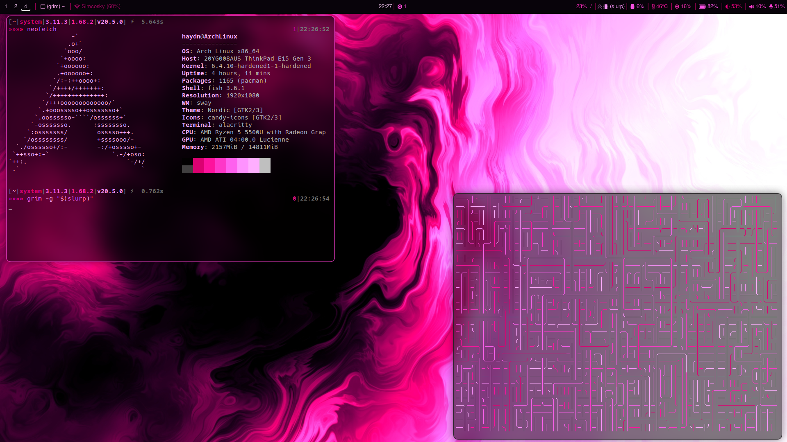

# dots

my dotfiles for my linux setup
The ascii cube for Macchina is from this repo: https://github.com/leonmavr/retrocube.
## Wallpaper
I dont remember where I got the wallpaper from but when I find the source I will put it here.

## Software
Here are the software I use for my setup

- [Waybar](https://github.com/Alexays/Waybar)
- [swayfx](https://github.com/WillPower3309/swayfx)
- [Macchina](https://github.com/Macchina-CLI/macchina)
- [SwayOSD](https://github.com/ErikReider/SwayOSD)
- [rofi](https://github.com/davatorium/rofi)
- [GammaDaemon](https://github.com/trollLemon/GammaDaemon)
- [neovim](https://github.com/neovim/neovim)
- [alacritty](https://github.com/alacritty/alacritty)
- [waybar-module-pacman-updates](https://github.com/coffebar/waybar-module-pacman-updates)

